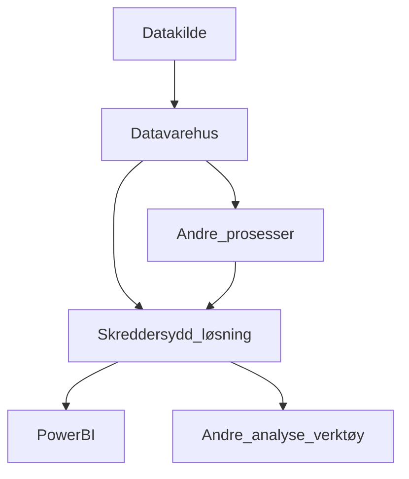

# Oppgave 3.1.1

## Hvis vi tar hensyn til tekniske begrensninger kunden har

Vi bør lage en skreddersydd løsning som gjør det lettere/automatiserer
eksporteringsprosessen fra datavarehuset til Power Bi. Grunnen til å
skreddersy en egen løsning i stedet for å bruke noen verktøy som
allerede finnes er at vi vet ikke hvilket datavarehus kunden bruker eller
andre prosesser som kjører “under the hood”. Da er det best å
skreddersy en egen løsning for å garantere kvalitet og garantere at alt
funker som det skal.

