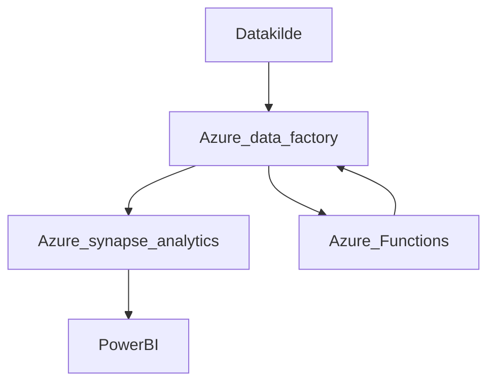

# Oppgave 3.1.2

## Hvis vi ikke tar hensyn til tekniske begrensninger kunden har til fordel for et helt nytt system

Hvis vi velger å lage et helt nytt system til kunden så blir nok det beste å
sette opp et cloud miljø til kunden, vi kan enten bruke Google Cloud,
Amazon Web Services eller Microsoft Azure siden de er de 3 største og
har flest tjenester i tillegg til bedre stabilitet. Jeg bruker Microsoft Azure
siden det er det jeg kan best, men vi bør se på de andre i tilfelle de har
mulighet for å gjøre dette lettere.

Vi kan erstatte datavarehuset til kunden med Azure Data Factory som
kan lagre all dataen, det vil også være lett å overføre all dataen til Azure data Factory pga innebygde connectors i data factory. Hvis kunden bare har
en type data så kan det være bedre å ikke bruke Data Factory til fordel
for en mer spesialisert tjeneste, som for eksempel Azure SQL DB eller
Azure Cosmos DB.
I Azure så kan vi også analysere og behandle dataene som vi vil ved
bruk av Azure Data Explorer eller Azure Synapse Analytics og Azure
Batch eller Azure Functions.
Da kan vi også eksportere all dataen vi vil fra Azure tjenester direkte til
Power BI.

